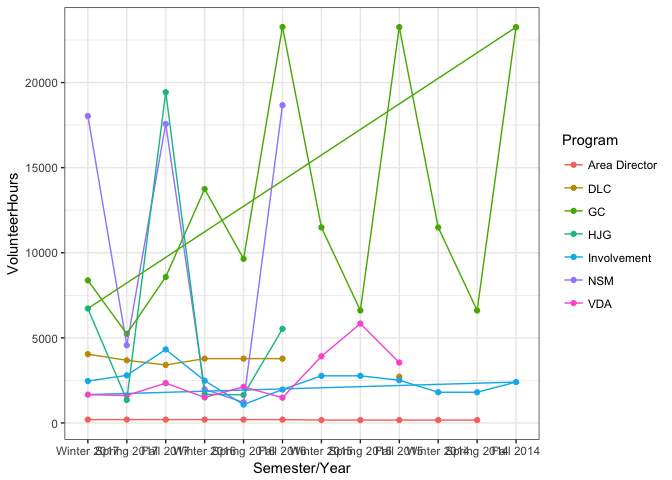

# StudSupVolunteerHours
Caleb Calhoun  
4/30/2018  


```r
library(readr)
library(tidyverse)
```

```
## Loading tidyverse: ggplot2
## Loading tidyverse: tibble
## Loading tidyverse: tidyr
## Loading tidyverse: purrr
## Loading tidyverse: dplyr
```

```
## Conflicts with tidy packages ----------------------------------------------
```

```
## filter(): dplyr, stats
## lag():    dplyr, stats
```

```r
ssvolhours <- read_csv("~/Downloads/Student Support Tidy Data for R - Volunteer Hours (1).csv", 
                                                               col_types = cols(X10 = col_skip(), X4 = col_skip(), 
                                                                                X5 = col_skip(), X6 = col_skip(), 
                                                                                X7 = col_skip(), X8 = col_skip(), 
                                                                                X9 = col_skip()), skip = 1)
```

```
## Warning: Missing column names filled in: 'X4' [4], 'X5' [5], 'X6' [6],
## 'X7' [7], 'X8' [8], 'X9' [9], 'X10' [10]
```

```r
ssvolhours$`Semester/Year` <- as.character(ssvolhours$`Semester/Year`)
ssvolhours$`Semester/Year` <- factor(ssvolhours$`Semester/Year`, levels = unique(ssvolhours$`Semester/Year`))


ssvolhours%>%
  group_by(.$`Semester/Year`)%>%
  ggplot(aes(x = `Semester/Year`, y = VolunteerHours, col = Program, group = 1))+
  geom_point()+
  geom_path()+
  theme_bw()
```

```
## Warning: Removed 21 rows containing missing values (geom_point).
```

```
## Warning: Removed 3 rows containing missing values (geom_path).
```

<!-- -->

